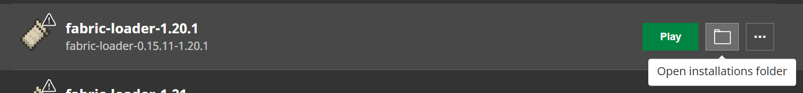
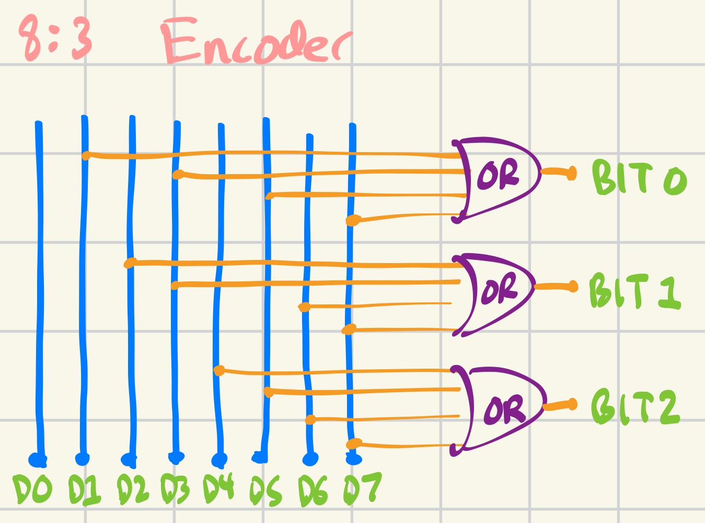
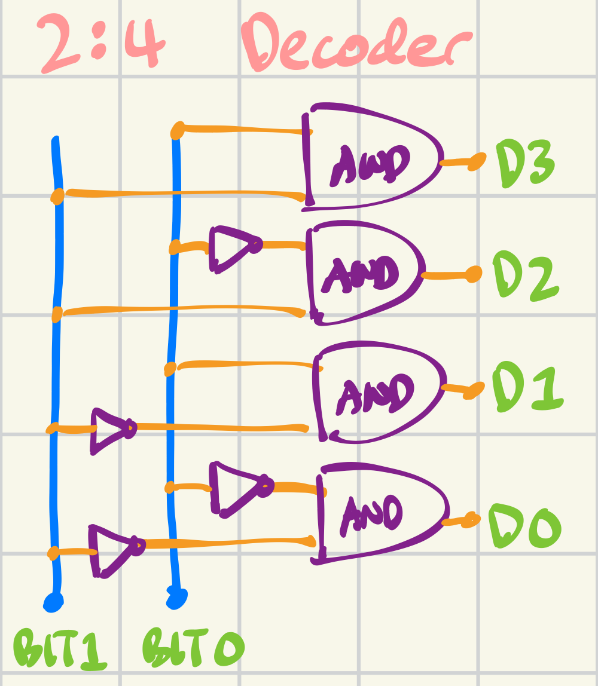
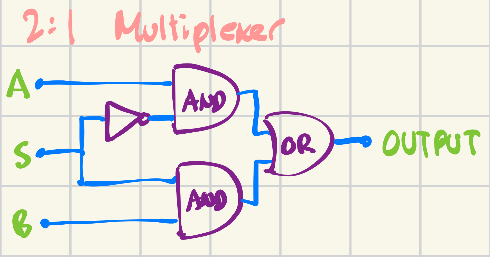
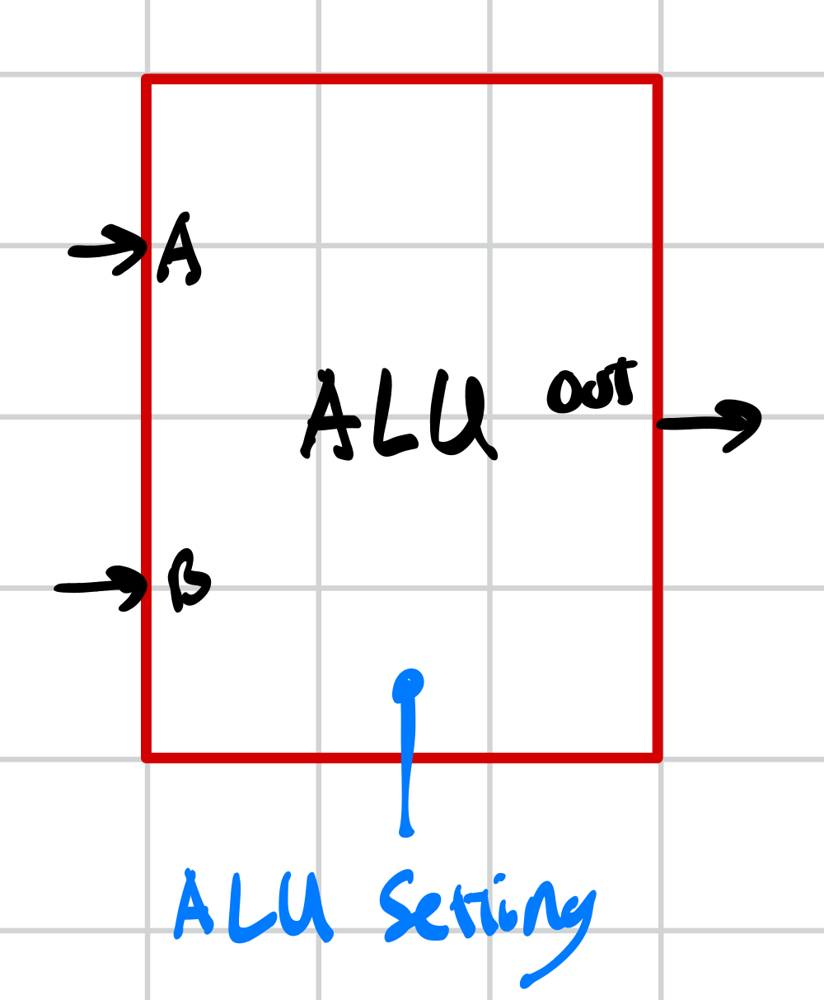
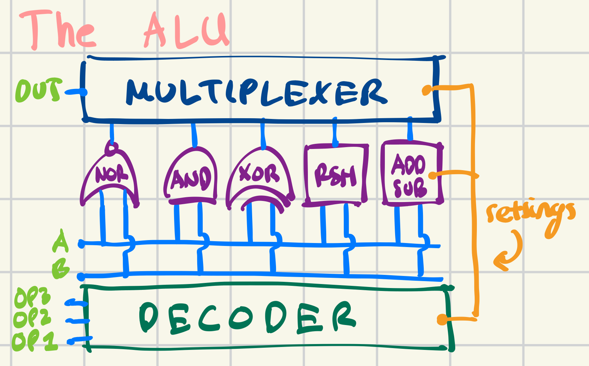
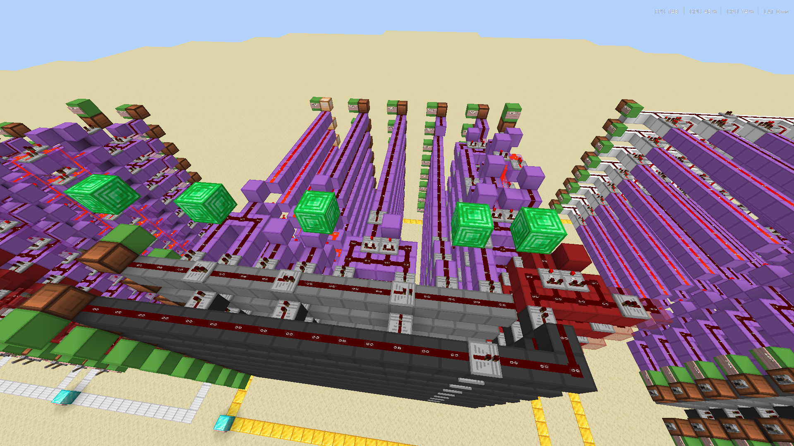
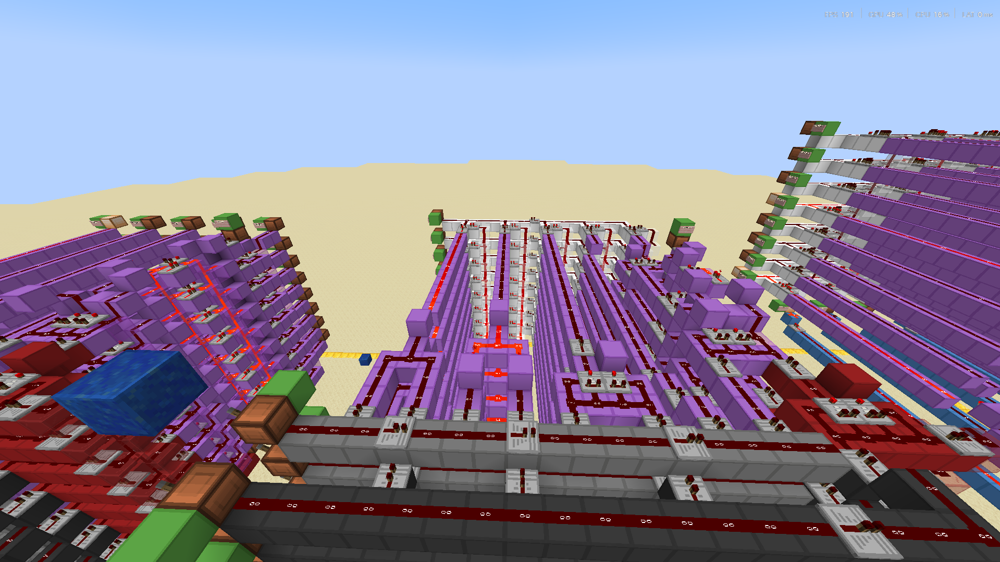
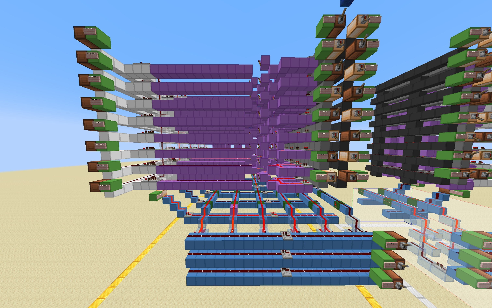

# CMSC389E Project 3 - The ALU

Due: **Friday, March 20th, 2025 at 11:59PM** on **[Gradescope](https://www.gradescope.com/courses/1240118/assignments/7536766/)**

This project involves building an **Arithmetic Logic Unit (ALU)** in Minecraft using Redstone! The goal is to implement fundamental digital logic circuits and integrate them into a working **ALU**. We will then extend the functionality of the **ALU** with **opcodes**.

## Importing Projects
To import the project, you need to download `project3 TEMPLATE.zip`, extract it, and move it into the `saves` folder of your Modrinth installation folder. The easiest way of doing this is the following:

1. Download `project3 TEMPLATE.zip` from this directory
2. Locate your `./Downloads` folder and extract the contents of `project3 TEMPLATE.zip`
3. Locate the `project3` folder INSIDE of the folder you extracted into
4. Use `Ctrl + X` or `Cmd + X` on the `project3` folder to cut it, saving it into your clipboard
5. Go to your Modrinth Launcher's and navigate to the CMSC389E instance we created during setup. Locate the button next to instance settings and click on **Open Folder**.

6. Navigate to the `saves` folder, and use `Ctrl + V` to paste `project3`
7. Finally, click the `Play` button to open Minecraft, go to "Singleplayer", and you should see **Project 3** has been successfully imported!

## Submitting Projects
Projects will be submitted and autograded via **Gradescope**. If you are not already in the **Gradescope**, the join code can be found in the syllabus. To submit the project, you will need to locate your `project3` world file, zip it into `project3.zip`, and submit it into the relevant Gradescope assignment. Here's a step-by-step:

1. Go to your Modrinth Launcher's and navigate to the CMSC389E instance we created during setup *(same as above)*. Locate the button next to instance settings and click on **Open Folder**.
2. Go to the `saves` folder, right click on `project3`, and compress it to **ZIP File**. 
3. Go to the Gradescope assignment and upload the relevant **ZIP File**.

## Notes (PLEASE READ)

* For any of the tasks, **DO NOT** destroy or move **ANY** of the **redstone lamps**. We hardcode the input/output locations for the autograder to test your builds. 
* You may build outside of the **Gold Blocks**, but we always provide you with enough space to complete your build inside. 
* The instructions for each of the problems will be located **here** in the **README.md**. In-game **problems**, **notes**, and **hints** correspond to descriptions in this **README.md**. You may expect future projects to be formatted in a similar manner.
* This project will **heavily** rely on the use of **Worldedit**, as with most projects in the future. We recognize that this can get tedious, and we are always open to feedback on ways that we can improve the course and the projects. 
* However, we also believe that in the context of building digital circuits in Minecraft for a **CPU**, understanding and being comfortable with using **worldedit** will be **instrumental**, and there's no way to get around this. Without **worldedit**, we'd have to provide you with largely filled-in templates for each problem, and there wouldn't be much to do (it also probably wouldn't be very fun). Our goal for you in this class is for you to essentially have placed **every block** in building a **CPU** with the assistance of **worldedit**. Of course, we won't have you do anything that is **too tedious** even with **worldedit**, like building the **Instruction Memory** or **RAM Unit**, which you will see in the future. 
* Because of **Worldedit**, it may be very easy to accidentally destroy the input/output **redstone lamps**. Please be careful to make sure you *don't do this*, and if you accidentally do, use `//undo`.

## Before we get to the ALU...

### Problem 1: Encoder (1 pt)
- Implement an **8 to 3 encoder**.
    - The encoder will convert decimal values **0-7** to their **binary representation**.
    - You may assume that only **one** of the inputs will be **ON** at a time
    - Note, your circuit implement will not follow the logic diagram below since the input lines are **inverted**. However, it will be similar by **double negation**.
    - Note, this implementation is the **preferred** implemetation of an **encoder** in Minecraft. We don't really need any other designs!
- The following logic gate description may help you:
<table>
<tr>

<td align="center" width="80%">

</td>

<td width="20%">

<table width="90%" cellpadding="0">
<tr>
<th>D0</th><th>D1</th><th>D2</th><th>D3</th><th>D4</th><th>D5</th><th>D6</th><th>D7</th><th>BIT 2</th><th>BIT 1</th><th>BIT 0</th>
</tr>

<tr><td>1</td><td>0</td><td>0</td><td>0</td><td>0</td><td>0</td><td>0</td><td>0</td><td>0</td><td>0</td><td>0</td></tr>
<tr><td>0</td><td>1</td><td>0</td><td>0</td><td>0</td><td>0</td><td>0</td><td>0</td><td>0</td><td>0</td><td>1</td></tr>
<tr><td>0</td><td>0</td><td>1</td><td>0</td><td>0</td><td>0</td><td>0</td><td>0</td><td>0</td><td>1</td><td>0</td></tr>
<tr><td>0</td><td>0</td><td>0</td><td>1</td><td>0</td><td>0</td><td>0</td><td>0</td><td>0</td><td>1</td><td>1</td></tr>
<tr><td>0</td><td>0</td><td>0</td><td>0</td><td>1</td><td>0</td><td>0</td><td>0</td><td>1</td><td>0</td><td>0</td></tr>
<tr><td>0</td><td>0</td><td>0</td><td>0</td><td>0</td><td>1</td><td>0</td><td>0</td><td>1</td><td>0</td><td>1</td></tr>
<tr><td>0</td><td>0</td><td>0</td><td>0</td><td>0</td><td>0</td><td>1</td><td>0</td><td>1</td><td>1</td><td>0</td></tr>
<tr><td>0</td><td>0</td><td>0</td><td>0</td><td>0</td><td>0</td><td>0</td><td>1</td><td>1</td><td>1</td><td>1</td></tr>

</table>

</td>

</tr>
</table>

    
<b>HINT 1:</b>

    Place <b>redstone torches</b> on the <b>Green Wool</b> if you want a bit to be <b>ON</b> when the <b>input line</b> is <b>ON</b>.

### Problem 2: Decoder (1 pt)
- Implement a **2 to 4 decoder**.
    - The decoder will convert binary values **00, 01, 10, 11** to their **decimal representation**.
    - Only **one** of the outputs should be **ON** at a time.
    - You may break the redstone in the template.
- The following logic gate description and truth table may help you:

<table>
<tr>

<td align="center" width="50%">

</td>

<td width="50%" align="center">

<table width="100%" cellpadding="20">
<tr>
<th>BIT 1</th><th>BIT 0</th><th>D0</th><th>D1</th><th>D2</th><th>D3</th>
</tr>

<tr><td>0</td><td>0</td><td>1</td><td>0</td><td>0</td><td>0</td></tr>
<tr><td>0</td><td>1</td><td>0</td><td>1</td><td>0</td><td>0</td></tr>
<tr><td>1</td><td>0</td><td>0</td><td>0</td><td>1</td><td>0</td></tr>
<tr><td>1</td><td>1</td><td>0</td><td>0</td><td>0</td><td>1</td></tr>

</table>

</td>

</tr>
</table>

    
<b>HINT 2:</b>

    Connect the lines at the <b>Green Wool</b> with either a <b>redstone torch</b> or just by connecting the lines. Placing <b>redstone torches</b> on the <b>Green Wool</b> represents a <b>NOT Gate</b> connection, in contrast to just connecting the lines.

<b>Note 2: Decoder Preferred Design</b>

- This is the preferred design for **Decoders** in Minecraft, since its vertical and we love vertical things. This specific design is a **3 to 8** decoder. Play around with it, and try to get a sense for how it works. You may use this design from now on!

- How it works is basically: torches **invert** the signal while **repeaters** carry them. Place a torch for bits you expect to be **ON**, and a repeater for bits you expect to be **OFF**. The result is essentially **OR'd** together by the **glass tower** and then **inverted** again. It essentially follows the diagram above, except **De Morgan's Law** (we love De Morgan's Law!!).

### Problem 3: Multiplexer (1 pt)
- Implement a **2 to 1 multiplexer**.
    - The **multiplexer** will allow you to select between which **input (of multiple)** to let through to the **output**.
    - The middle signal acts as the **select bit**, which allows you to toggle between letting **input A** or **input B** into the **output**.
    - When the **select bit** is **0 (OFF)**, **input A** is transmitted. When the **select bit** is **1 (ON)**, **input B** is transmitted.
- The following logic gate description and table may help you:

<table>
<tr>

<td align="center" width="50%">

</td>

<td width="50%" align="center">

<table width="100%" cellpadding="8">
<tr>
<th>A</th>
<th>B</th>
<th>S</th>
<th>OUTPUT</th>
</tr>

<tr>
<td align="center">0</td>
<td align="center">X</td>
<td align="center">0</td>
<td align="center">0</td>
</tr>

<tr>
<td align="center">1</td>
<td align="center">X</td>
<td align="center">0</td>
<td align="center">1</td>
</tr>

<tr>
<td align="center">X</td>
<td align="center">0</td>
<td align="center">1</td>
<td align="center">0</td>
</tr>

<tr>
<td align="center">X</td>
<td align="center">1</td>
<td align="center">1</td>
<td align="center">1</td>
</tr>

</table>

</td>

</tr>
</table>

<b>Note 3A: Multiplexer Preferred Design</b>

- This is the preferred design for **Multiplexers** in Minecraft. This specific design is a **2 to 1** multiplexer with individual levers used for selecting which input to transmit.

- Note the mechanism by which it works: We are **cancelling** the input signal with a comparator on **subtract mode** using a **repeater** feeding into the side of the comparator. When the **repeater** is on, the input signal is blocked.

- Only when one of the **select** signals are **ON**, does the corresponding **repeater** turn **OFF** and the associated input signal is transmitted.

- Also note that in practice, if we had more inputs (e.g. 8 inputs), we would use a **decoder** to turn **ON** the appropriate **select** signal.

<b>Note 3B: 8-bit Multiplexer</b>

- This is the same design of multiplexer but stacked up **7 times** to create an **8-bit multiplexer**.

- The multiplexer works **independently** on each "level".

- Notice the **glass towers** transmitting the redstone signal up to each level.

## Now let's start building the ALU!

<!-- </img> -->
| | |
|---|---|
|  | The **ALU (Arithmetic Logic Unit)** is the first component of the **CPU** that we will build. The **ALU** performs basic arithmetic (addition, subtraction) and logic operations (not, and, nand, xor, etc.) on its **input operands**. The **ALU** takes in **two inputs** and a **control signal** telling the **ALU** which operation to select for **output**. See the diagram to the left
| Note, our **ALU** will only implement the **NOR, AND, XOR, RSH (right shift), ADD, and SUB** operations. We can derive all other operations (including **NOT, OR, NAND, etc.**) with just these operations. Refer to the image to the right for a rough logic diagram of the **ALU** we will build. |  |

Let's start out by building the **8-bit logic gates**. We would highly recommend using **Worldedit** here or it might be painful lmao. Consider using the `//stack 7 up` command.

### Problem 4: 8-bit NOR Gate (1 pt)
- Stack a **NOR gate** **7 times** upwards to create an **8-bit NOR Gate**. Test with inputs to verify correct outputs.
- **Hint 4:** Single-layer **NOR Gate** provided.

### Problem 5: 8-bit AND Gate (1 pt)
- Stack an **AND gate** **7 times** upwards to create an **8-bit AND Gate**. Test with inputs to verify correct outputs.
- **Hint 5:** Single-layer **AND Gate** provided. Note the use of **De Morgan's Law** (wowie!)
    - Why do we design the **AND Gate** this way, instead of the traditional way? (You don't actually have to answer this)

### Problem 6: 8-bit XOR Gate (1 pt)
- Stack an **XOR gate** **7 times** upwards to create an **8-bit XOR Gate**. Test with inputs to verify correct outputs.
- **Hint 6:** Single-layer **XOR Gate** provided.

<b>Note 6A: RSH (right shift) provided!</b>

- We've provided the **8-bit** right shift operation.

- Notice how the **7th output bit** is always **OFF**.

<b>Note 6B: CCA (carry cancel adder)</b>

- This is a **Carry Cancel Adder**, the *start of the art* implementation of an **8-bit adder** in Minecraft!

- You don't need to know how it works — but you will need to use it in the future.

<b>Note 6C: ADD/SUB operations provided!</b>

- We've provided the **ADD/SUB** operations with this modified **CCA**.

- Notice, we've added an **Adder Setting** signal.

- When the signal is **OFF**, the adder performs **addition**.

- When the signal is **ON**, the adder performs **subtraction** by **inverting input B** and turning on the **Carry In signal**, essentially applying **Two's Complement**.

- The design *slickly* **inverts B** by feeding **ON** values into an **XOR Gate** with **input B**.

- You will use this design to complete your **ALU** by using the `//copy` and `//paste` worldedit commands.

### Problem 7: Combining Operations (1 pt)
- Use **Worldedit** to **copy & paste** the **NOR, AND, XOR, RSH, and ADD/SUB** operations so that they are **adjacent** with each other, with a **one-block gap** in between, in that **specific order**. Ensure that they are aligned with the **output lamps**.
    - You may use the **emerald blocks** as references for copy and pasting. There is one **high** near the inputs and **low** near the outputs, which should capture what you want to copy. Remember, `//copy` and `//paste` work relative to player position, so I would stand on top of the **high** emerald block when using these commands so your relative positioning is consistent.
- Then, feed **input A** and **input B** into each of the operations, using the **wire crossing technique**.
    - It may help to do this on the bottom level first, and then **stack it 7 times up**.
    - When **stacking**, it is benefical to stack components separately, otherwise there will be spacing issues (height 2 builds vs. height 3 builds). We suggest you stack the crossed wires and the logic gates separately  and (`//stack 7 up`)

- **Hint 7A:** Single-layer example of crossing wires to feed into **NAND** and **OR** gates.
- **Hint 7B:** 8-bit example of crossing wires to feed into **NAND** and **OR** gates (i literally just used `//stack 7 up`)
- We've essentially made a machine that takes in **two inputs** and computes a bunch of different operations with them! It should look something like the following image:

### Problem 8: Selecting an Operation (1 pt)
- We're almost there! We have a machine that can compute a bunch of operations from our two inputs, but what if we want to just select a single operation to perform? 
- Add a **Multiplexer** onto the outputs of all of the **operations**. Each operation will have its own **selection** signal. When the **selection** signal for a given **operation** is toggled **ON**, the result of performing that operation is transmitted as the **output**. 
    - Note, you may use the **Lapis (blue) blocks** as a reference for copy and pasting from **Problem 7** to **Problem 8**.
- **Hint 8A:** Single-layer example of adding a **2 to 1** multiplexer to the outputs of the **NAND** and **OR** operations.
- **Hint 8B:** 8-bit example of adding a **2 to 1** multiplexer to the outputs of the **NAND** and **OR** operations (Notice the **glass towers** carrying the redstone signal up, to cancel the **comparators**)
- And now, we essentially have an **ALU** that does everything we want it to do based on the description above! The **ALU** takes in **two inputs** and **control signals** telling the **ALU** which operation to select for **output**. It should look something like the following image:

### Problem 9: ALU with Opcodes (2 pts)
- Let's extend the functionality of our **ALU** to work with **opcodes** (yes, the same ones from **CMSC216** :D. For now, we will use 3-bit opcodes, since that's all we need (eventually we'll extend to 4-bit opcodes when we add more complicated instructions). 
- Add a **decoder** to the **opcode input** line to select the right operation for the **ALU** to perform based on the following table:
    | Opcode | Operation |
    |----|----|
    |  000  |  NOR  |
    |  001  |  AND  |
    |  010  |  XOR  |
    |  011  |  RSH  |
    |  100  |  ADD  |
    |  101  |  SUB  |
    - The rightmost bit of the opcode is **Opcode Bit 0**, since it is the least significant bit.
    - Note, you may use the **Lapis (blue) blocks** as a reference for copy and pasting from **Problem 8** to **Problem 9**. **Be careful to use paste -a to ignore air blocks when pasting.**
    - Use the **preferred decoder design** from earlier in the project. Place a torch for bits you expect to be **ON**, and a repeater for bits you expect to be **OFF**. A more in-depth explanation of how the decoder works can be found in **Note 2**.
    - Note, for the **SUB** operation, you will also need to wire the decoded result into the **Adder Setting** (since we want it to be **ON** when doing subtraction). This also means that the wiring for **ADD** to select the **ADD/SUB** operation should not interfere with the **Adder Setting**, since we want it to be **OFF** when doing addition. 
    - The autograder will only toggle **input A, input B, and opcode** levers for this part. You are expected to set the multiplexer and adder control signals based on the **opcode**.
- **Hint 9:** 8-bit example of adding an **opcode decoder** to have the **ALU** perform operations **OR** when the opcode is **110**, and **NAND** when the opcode is **111**.
- Your design should look something like this:

- And now, we've finished building a fully functioning **ALU** that enables operation selection with **opcodes** (tell your friends how cool this is)! For the next project, we'll construct a **Register** file which will allow us to perform **ALU** operations in sequence by storing operation results in memory. We'll be able to compute the **Fibonacci sequence** up to 233 (**255** is the limit for 8 bits)!

ඞ
