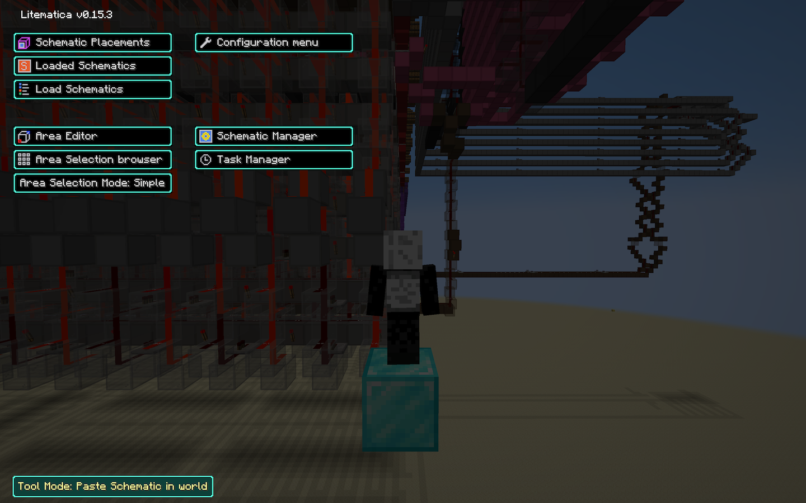
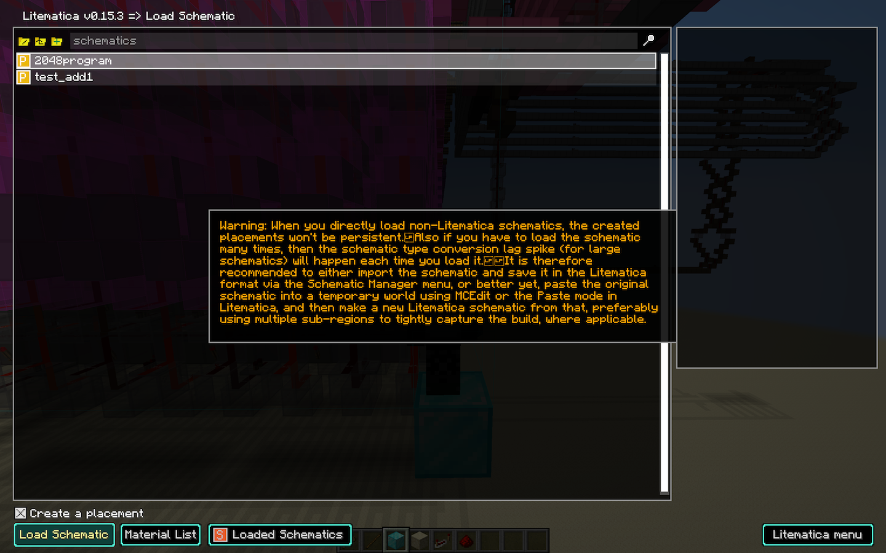
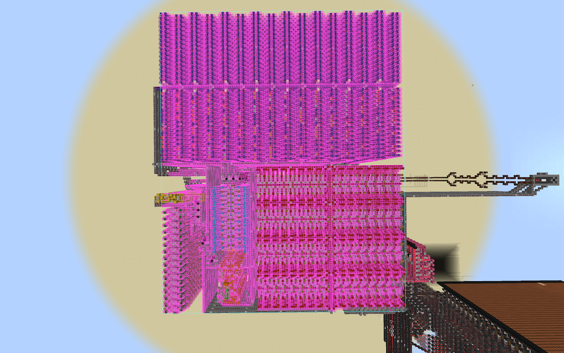
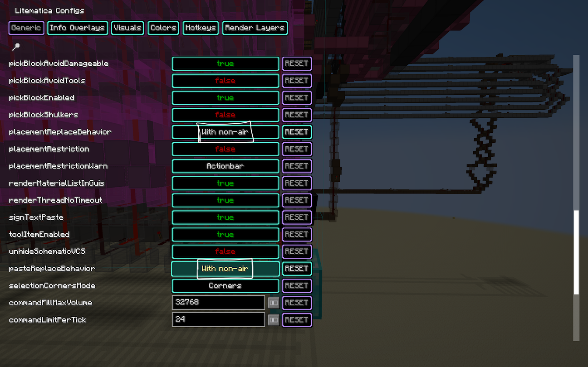
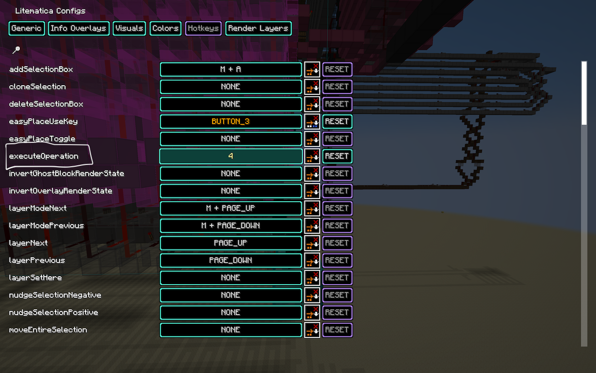
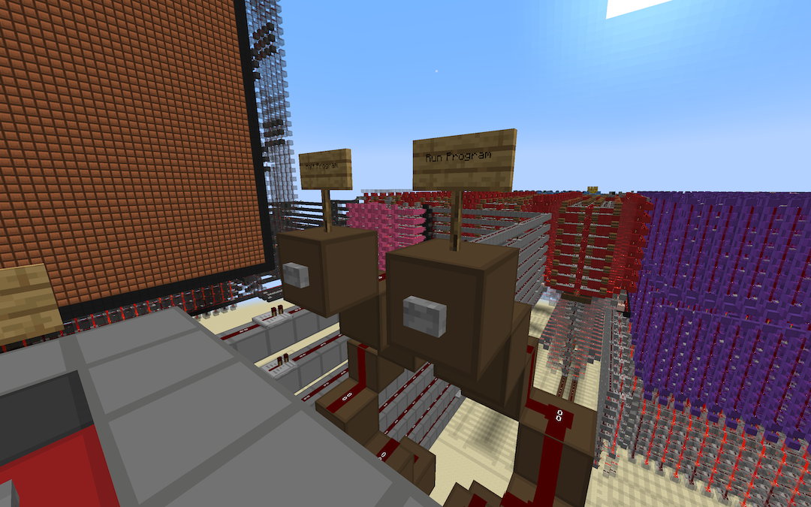

# CMSC389E Final Project

Due: **Wednesday, December 17th, 2025 at 11:59PM** on **[Gradescope](https://www.gradescope.com/courses/1115053/assignments/7198918/)**

The **final project** will emcompass utilizing a finished CPU implementation in **Minecraft** to run a program of your choice. You will then submit a **2-3** paragraph report summarizing what you did. For more details on the report, see step 7 below

## Importing Projects
To import the project, you need to download `projectfinal TEMPLATE.zip`, extract it, and move it into the `saves` folder of your Fabric installation folder. The easiest way of doing this is the following:

1. Download `projectfinal TEMPLATE.zip` from this directory
2. Locate your `./Downloads` folder and extract the contents of `projectfinal TEMPLATE.zip`
3. Locate the `projectfinal` inside of the folder you extracted into
4. Use `Ctrl + X` on the `projectfinal` folder to cut it, saving it into your clipboard
5. Go to your Minecraft Launcher and locate the **Installation Folder** for `fabric-loader-1.20.1`, similar to what you did during setup. Click on "Open installations folder"

5. Navigate to the `saves` folder, and use `Ctrl + V` to paste `projectfinal`
6. Finally, run Minecraft, go to "Singleplayer", and you should see **Project 2** has been successfully imported!

## Submitting Projects
The final project will be submitted via **Gradescope**. For this project, you will submit a **pdf report** that is described below. That is all you need to submit for this project.

## Resources

* [**Final Project Video (from in class)**](https://umd.hosted.panopto.com/Panopto/Pages/Viewer.aspx?id=19c78159-3359-4f17-ac54-b2d800f95308)
* [**BATPU-2 Readme & Sample Programs**](https://github.com/mattbatwings/BatPU-2)
* [**BATPU-2 Instructions Set**](https://docs.google.com/spreadsheets/d/12urAGQ1eXuVUJTJ9l9LwMtBRvsr5gCwXs8DY92yWrZw/edit?usp=sharing)
* [**Minecraft CPU Simulator**](https://github.com/AdoHTQ/Batpu2-VM/releases) - will be useful for crafting your program!

## Project Outline

We provide you the completed implementation of the **Minecraft CPU** in `projectfinal TEMPLATE.zip`. You should import the world per the instructions above.

We also provide you with the following scripts:
| Script | Purpose |
|-|-|
| `assembler.py` | Converts assembly language into machine code |
| `schematic.py` | Converts machine code into a minecraft pasteable schematic |
| `main.py` | Calls `assembler.py` and `schematic.py` to converge an assembly file into a schematic. Usage: `python main.py [filename]`|

* You will use `main.py` to convert your **assembly program** to a **minecraft schematic** that you will paste into your world.
* Note, a **minecraft schmatic** is simply a blueprint/template file that can be use to transfer builds between worlds. We will demonstrate using a schematic below, so don't worry!

Your task will be to do the following:
### 1. Write an assembly program of your choice!
- Your program can do anything. Here are some ideas:
  
    - Compute the fibonacci sequence up to 255
    - Compute the primes up to 255
    - Implement your favorite sorting algorithm (bubble/selection/insertion/quick, etc.)
    - Perform multiplication of two numbers
    - Draw a smiley face
- Use the following [instruction set](https://docs.google.com/spreadsheets/d/12urAGQ1eXuVUJTJ9l9LwMtBRvsr5gCwXs8DY92yWrZw/edit?usp=sharing) and example [programs](https://github.com/mattbatwings/BatPU-2/tree/main/programs) as reference

> If you want to do something with character arrays, look more into matbatwings' readme. It has information on how to use character buffers. You don't need to worry about things like ASCII codes, you can simply use single characters directly in the .as file (the scripts will take care of that). In a way, the assembly is a bit more modern.

### 2. Use `main.py` to compile your assembly program into a schematic
- To use `main.py`, simply run `python main.py [filename]` where `filename` is your assembly program.
- Note: The assembly file you want to compile should be in a `programs` folder on the same level as `main.py`.

### 3. Move the schematic into your `./schematics` folder
- You will need the **litematica** and **malilib** mods, which you should have installed during the **setup** project. If you don't have them, then refer to [setup/downloads](https://github.com/umd-cmsc389e/spring25/tree/main/setup). 
- Navigate to your schematics folder, located in `.minecraft > schematics`. It should be on the same level where `saves` is. If you don't see a `schematics` folder, simply create it. 
- Then, paste the produced schematic file (ex. `fibonacciprogram.schem`) into that directory, similar to how you imported the project world file into `saves`.

### 4. Paste the schematic into the completed CPU implementation

1. Now, in your minecraft world, stand at the diamond block at **109, 90, 43** and press `m` on your keyboard. A litematica UI should pop up. In the lower left hand side, ensure the tool mode reads **"Place Schematic in world"**. 

2. Next, you should see a button labeled `load schematics`. Click on it and select your schematic file (ex. `fibonacciprogram.schem`), then select `load schematic` at the bottom left. 

3. Now escape out of all the menus. You should see all the blocks and repeaters in place. Note, the script also places the necessary repeaters to clear the data memory, data stack, and other necessary components - along with pasting the compiled program into the instruction memory.

4. After this, hit `m` and navigate to `configuration menu`. In the `generic` menu, find the `pasteReplaceBehavior` and `placementReplaceeBehavior`, and set them to non-air.
   

5. Then hit the `hotkeys` menu. In the generic tab Select a hotkey for the **executeOperation** field.

6. Now exit all the litematica menus and **grab a wooden stick** and use that hotkey. All your instruction memory should now be pasted in properly!

### 5. Run the Minecraft CPU
Before running the program, ensure you run `/tick rate 500` otherwise the program will take too long to run. If you feel you need to speed up your program further and your OS is Windows (_sorry mac users_), you can dabble into using MCHPRS - a custom server designed to speedup redstone to incredible speeds.  

Now, Run the program!

> If you want to unload the memory, go to the litematica menu -> loaded schematics -> unload your specific schematic.

### 6. Gather results, and verify the program.
- Take screenshots, take note of things you've observed.

### 7. Compile a Report

In your report, please include the following:

1. **Evidence of your program running**
   - Include screenshots or a link to unlisted video(s) showing your output in your Minecraft world or the CPU emulator.
   - If your program takes too long to run in Minecraft, showing the emulator alone is fine.
   - If you have trouble using the emulator (especially on macOS), mention that in your report.

2. **Assembly code**
   - Include the assembly you used to run the program, following the [Minecraft ISA](https://docs.google.com/spreadsheets/d/1kaXqxGnB-w7aPgPNoQdTv-PDBBjr2vg3yapR5_SZPoI/edit?usp=sharing).

3. **Short write-up (1–2 paragraphs)**
   - What did your program aim to accomplish?
   - Did you run into any problems? If so, how did you solve them?
   - How long did it take to run?
   - How did you verify your program?
   - If you were given more time or better compute (e.g., MCHPRS), would you do things differently?
